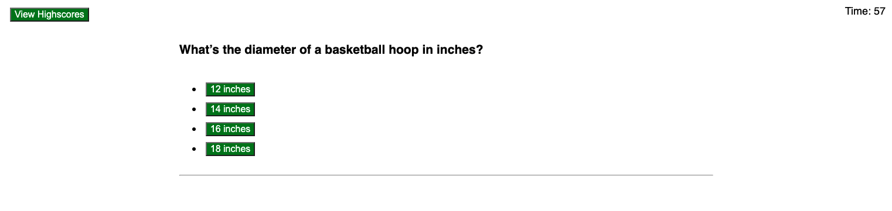
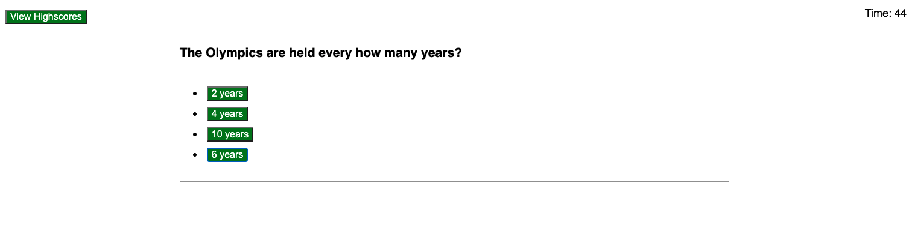
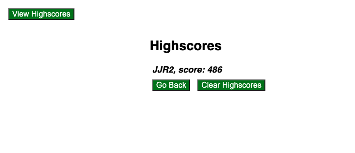

# Code Quiz

## Your Task

As I proceed in your journey to becoming a full-stack web developer, it’s likely that you’ll be asked to complete a coding assessment, perhaps as part of an interview process. A typical coding assessment is a combination of multiple-choice questions and interactive coding challenges. 

To help I become familiar with these tests and give I a chance to apply the skills from this module, this week’s homework invites I to build a timed coding quiz with multiple-choice questions. This app will run in the browser, and will feature dynamically updated HTML and CSS powered by JavaScript code that I write. It will have a clean, polished, and responsive user interface. This week’s coursework will teach I all the skills I need to succeed in this assignment.


## User Story

```
AS A coding boot camp student
I WANT to take a timed quiz on JavaScript fundamentals that stores high scores
SO THAT I can gauge my progress compared to my peers
```
## Screenshots of working quiz









## Live Link

https://jr-source.github.io/Quiz-Game/